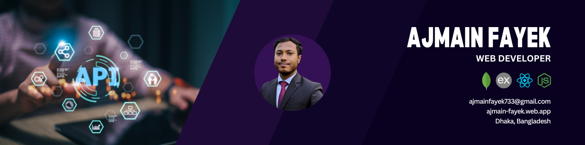

 

###

<h1 align="left">Ajmain Fayek</h1>

###

Web Programmer || Frontend Developer

###

<h2 align="left">About me</h2>

###

✨ Creating bugs since 2021 
  
  📚 Currently working on StructoMate
   
  
  🎯 Goals: 
   - Master the MERN stack
   - Building dynamic, secure, scalable ,and user-friendly web applications 
    
  🎲 Fun fact: Developers don't write bugs; they create unexpected features! 😄

###

<h2 align="left">Frontend stacks</h2>

###

  
  
  
  
  
  
  
  
  
  
  

###

<h2 align="left">Backend stacks</h2>

###

  
  
  
  
  

###

<h2 align="left">Tools</h2>

###

  
  
  
  
  
  
  
  
  

###

<h2 align="left">Social</h2>

###

  
  

###

<h2 align="left">Stats</h2>

###

  
  
  
  

###
